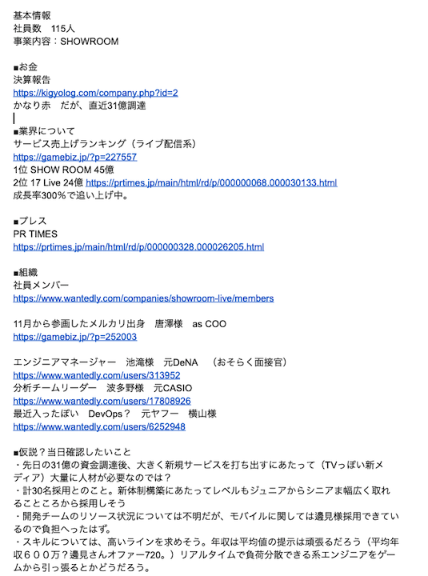

## Client Reserch Training
#### 2019 Dec 
#### Kaori Ohashi

---
## 研修の全体像
- 今日：30mins
  - しっかりした企業理解の為に必要なものについて、話します
- 次回：45mins
  - 各自、研修を踏まえた上でBDを１件行い、その感想を話し合いましょう
--
### 今日話すこと・話さないこと
- 話すこと
  - クライアントMTGの目的ってなに？ 
  - アポ前準備の7STEPS
- 話さないこと
  - 特定の業界知識や職種について 

---

## 対象となる事象
- 候補者にうまく企業の魅力をプレゼンできていない 
- 求人票以上の情報をヒアリングできない 
- 業界や職種の理解が不足している気がする

---

### さぁいってみよう🤗

---

### まず、クライアントMTGのゴールは何でしょう？
- 候補者に刺さる「ピッチ」ができるようになること  | 

---

### つまり...  
- 候補者が、あなたのピッチを聞いたときに具体的に自分が働いているイメージが「明瞭に」できること。 |

---

### なぜ？ 
- 具体性の高いピッチを聞くことで、候補者の中の優先順位が高くなる |

---

__なぜ__は理解したけど、 __何を__すればいいの？

---

## 徹底した準備です🔥
「打ち合わせ」は「ただ話す時間」ではなく __「仮説検証」__のお時間です。

---
@snap[west text-center]
### アポ前準備 ７STEPs
@snapend

--

@snap[east text-center]
@ul[list-square-bullets list-spaced-bullets]
1. 基本のWEBサーチ
1. より詳細なWEBサーチ 
1. HR や関係者にヒアリング 
1. 同業他者へのヒアリング
1. 1-4の事前準備資料作成
1. 想定課題の設定
1. Solution提案を用意
@ulend
@snapend

---
### ひとつひとつ詳細に説明しよう！

---
@snap[west]
### STEP1
### HPやまとめサイト、Wantedlyなどを中心に情報収集をする。
会社の概要と募集要項の把握
@snapend

---
@snap[west]
### STEP2
### IR情報や社員のSNS等、より詳細な情報を集める
お金の流れと人の流れを把握する
@snapend

---
@snap[midpoint span-70]
### ここまではできている人も多いです ...ここからが本番😇
@snapend

---
@snap[west]
### STEP3
### HRや関係者にヒアリングをする
組織図と、募集のバックグラウンドを理解する
@snapend

---
@snap[west]
### STEP4
### 同業他社の同じポジションで仕事をしている人にヒアリング
客観的な企業イメージを理解する （業界理解にも繋がる）
@snapend

---
@snap[west]
### STEP5
### 1-4をまとめ、自分用の事前準備資料を作成する
@snapend

---
@snap[west]
### STEP5
こんな感じ→

@snapend

---
@snap[west span-80]
### STEP6
### 想定課題の設定
なぜRGFの話を聞いているのか、相手のニーズに対して仮説を立てる
@snapend

---
@snap[west]
### STEP7
### STEP6の内容を元に、当日の提案を用意する

#### __GOAL__
 事前のサーチに基づいた提案（アイデアやブラインドレジュメ）でいつまでに誰を決めるか、イメージを固める
@snapend

---
- 事前準備をしっかりして望めば、１回の打ち合わせで__人事と同じ目線で__企業を語れるレベルまで持っていける

---
- ~~候補者にうまく企業の魅力をプレゼンできていない~~
  - 企業の魅力づけについて、__仮説に基づいて__話し合う時間が取れる
- ~~求人票以上の情報をヒアリングできない~~
  - 詳細なスキル感、組織構成やレポートラインまで把握できる
- ~~業界や職種の理解が不足している気がする~~
  - 事前サーチを重ねることで業界や職種についてどんどん詳しくなる

---
@snap[west]
### 実際にやってみよう😎
@snapend

@snap[east]

@snapend

---

### Case Study : SHOWROOM社（当日の持ち時間15分）

---

