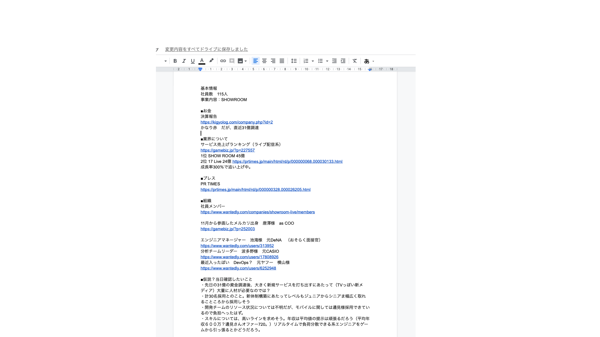

## Client Reserch Training
#### 2019 Dec 
Kaori Ohashi

---
### 研修の全体像
- 今日:30mins
  - しっかりした企業理解のために必要なものについて、話します
- 次回（約１週間後):45mins
  - 各自、研修を踏まえた上でBDを１件行い、 その感想を話し合いましょう

---

### 今日話すこと・話さないこと
- 話すこと
  - クライアントMTGの目的ってなに？ 
  - アポ前準備の7STEPs 
- 話さないこと
  - 特定の業界知識や職種について 

---

## 対象となる事象
- 候補者にうまく企業の魅力をプレゼンできていない 
- 求人票以上の情報をヒアリングできない 
- 業界や職種の理解が不足している気がする

---

### さぁいってみよう🤗

---

### まず、クライアントMTGのゴールは何でしょう？
- 候補者に刺さる「ピッチ」ができるようになること | 

---

### つまり...  
- 候補者が、あなたのピッチを聞いたときに具体的に自分が働いているイメージが「明瞭に」できること。 |

---

### なぜ？ 
- 具体性の高いピッチを聞くことで、候補者の中の優先順位が高くなる |

---

__なぜ__ は理解したけど、  __何を__ すればいいの？

---

## 徹底した準備です🔥
「打ち合わせ」は「ただ話す時間」ではなく __「仮説検証」__のお時間です。

---

@snap[west text-center]
### アポ前準備 ７STEPS　
@snapend

@snap[east text-center]
  @ul[list-spaced-bullets list-fade-fragments]
  1. 基本のWEBサーチ 
  1. より詳細なWEBサーチ
  1. HRや関係者にヒアリング 
  1. 同業他社へのヒアリング
  1. 1-4の事前準備資料作成
  1. 想定課題の設定
  1. Solution提案を用意
  @ulend

---
### ひとつひとつ説明しよう！

---
@snap[west]
### STEP1
### HPやまとめサイト、 Wantedlyなどを中心に情報収集をする。
会社の概要と募集要項の把握
@snapend

---
@snap[west]
### STEP2
### IR情報や社員のSNS等、 より詳細な情報を集める
お金の流れと人の流れを把握する
@snapend

---
### ここまではできている人も多いです ...ここからが本番😇

---
@snap[west]
### STEP3
### HRや関係者にヒアリングをする
組織図と、募集のバックグラウンドを理解する
@snapend

---
@snap[west]
### STEP4
### 同業他社の同じポジションで 仕事をしている人にヒアリング
客観的な企業イメージを理解する（業界理解にも繋がる）
@snapend

---
@snap[west]
### STEP5
### 1-4をまとめ、自分用の事前準備資料を作成する
@snapend

---
@snap[north]
### STEP5   こんな感じ↓
@snapend
@snapend[midpoint]

@snapend

---
@snap[west span-80]
### STEP6
### 想定課題の設定
なぜRGFの話を聞いているのか、 相手のニーズに対して仮説を立てる
@snapend

---
@snap[west]
### STEP7
### STEP6の内容を元に、 当日の提案を用意する

#### __GOAL__
 事前のサーチに基づいた提案 （アイデアやブラインドレジュメ）で いつまでに誰を決めるか、イメージを固める
@snapend

---
@snap[west]
### 実際にやってみよう😎
@snapend

@snap[east]

@snapend

---

